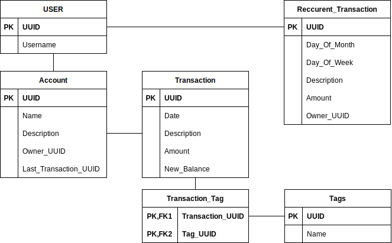

# Serverless Bank Manager
A simple multi user, multi account bank manager, aimed to use AWS feature to be serverless

# Purpose
The goal of the application is to manage bank accounts for different users. You will be able to :
* Initiate a bank account with an amount of money
* Register transactions
* Label transactions with tags to have a monthly summary
* Program recurrent transactions, every month or every day of week
* Have a forecast taking in account recurrent transactions coming

If I have time and courage, I may add an estimation for a monthly cost on tag based on previous months actual cost. For example, if you need to have an estimation over your monthly grocery cost, and you tagged grocery related transactions well, it will include the average cost over previous months into the forecast.

# How I want it to work
The purpose of the application is merely an excuse for me to try and work without any server on AWS, so I will try to make it all work without using an EC2 virtual machine.

I will use :
* AWS Cognito for user management
* AWS Lambda with Python Scripts for the backend code
* AWS Aurora for database (old style relationnal, PostgreSQL)
* S3 and/or CloudFront to serve something that should be a frontend ...
* Terraform to automate resource creation

That may change since I don't know yet what I'm facing. For example, I don't know yet where my logs will go, but I need them !

# Database Schema

